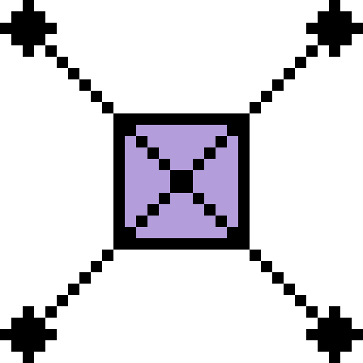

# Obicon

<p align="center"></p>

Self-hosted synthetic monitoring, built for observability. Lightweight nodes deployed anywhere run your tests (ping, traceroute, HTTP, HTTPS, TCP, DNS) and report back through a central server, and everything lands in your observability stack, no glue needed.

## Quick start

Published images on ghcr.io — no build required. (Building from source and running the tests are covered in [Contributing](docs/contributing.md).)

```bash
# 1. Start the server and its PostgreSQL database (API on http://localhost:5000)
docker compose up -d
```

The `docker-compose.yml` in the repo root runs the server image next to a PostgreSQL container and creates the database automatically. Without compose:

```bash
docker network create obicon
docker run -d --name obicon-db --network obicon \
  -e POSTGRES_DB=obicon -e POSTGRES_USER=postgres -e POSTGRES_PASSWORD=postgres \
  postgres:18-alpine
docker run -d -p 5000:5000 --network obicon \
  -e ConnectionStrings__Default="Host=obicon-db;Database=obicon;Username=postgres;Password=postgres" \
  ghcr.io/enessene/obicon/server:latest

# 2. Connect a node with an enroll token (create it on the server's settings page)
docker run -d --cap-add=NET_RAW \
  -e Node__ServerUrl="ws://<server-host>:5000/ws/nodes" \
  -e Node__EnrollToken="<enroll token>" \
  -e Node__RequireTls=false \
  ghcr.io/enessene/obicon/node:latest
```

The API is at http://localhost:5000 with Swagger at `/swagger` — create a node with `POST /v1/nodes`, a test with `POST /v1/tests`, and watch the runs land in `GET /v1/test-runs`; the full reference is the [API specification](docs/api-spec.md). (The web UI that ships in the repo is not published as an image and is not needed to run Obicon.) The server serves Prometheus metrics at `/metrics` on port 5000 and each node at `/metrics` on its own port (default 9464), and the Grafana dashboards in [`observability/`](observability/) import as-is.

## Documentation

- [Getting started](docs/getting-started.md)
- [Contributing](docs/contributing.md)
- [Server](docs/server.md) | [Node](docs/node.md) | [Metrics](docs/metrics.md)
- [API specification](docs/api-spec.md)
- [Grafana dashboards](observability/)
