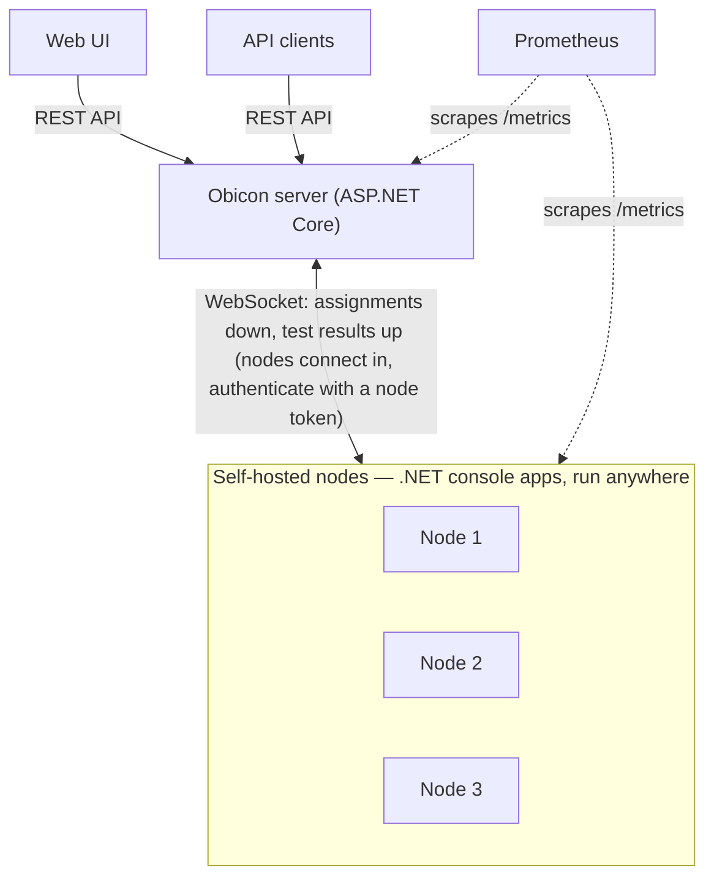

# Obicon

Obicon is a self-hosted synthetic API testing solution. A central server schedules and queues tests, self-hosted nodes around the world execute them against your targets, and results flow back through a queue and into Prometheus.

## How it fits together

- **Server** — ASP.NET Core app (port 5000): REST API under `/v1`, WebSocket hub for nodes at `/ws/nodes`, PostgreSQL storage, job queue, frequency scheduler. Serves its own health checks and Prometheus metrics.
- **Node** — small .NET console app: connects to the server with an auth token, sends heartbeats, and executes tests (ping, traceroute, HTTP, HTTPS, TCP, DNS) with capped concurrency. Exposes `/health` and Prometheus `/metrics` of its own.
- **Frontend** — static HTML/JS pages (port 5003) served by a tiny ASP.NET Core app: dashboard, nodes, pools, tests, queue, server stats, settings. Not published as an image and not needed to run Obicon — run it from a source checkout ([Contributing](contributing.md)); everything it does is a plain REST call.

## Feature summary

- Six test types with per-test timeout, IP version selection, and expectations: HTTP status codes, response body regex, custom headers, proxies, and cache busting for HTTP(S); TLS certificate expiry; DNS results
- Tests target individual nodes and/or node pools; nodes carry labels, and pools have descriptions
- Frequency-based scheduling from configurable presets, with catch-up-free recovery after downtime
- Job queue with NoRun detection (node never acknowledged, never started, or never came online)
- Node management: manual token flow or self-enrollment with expiring enroll tokens, optionally scoped to a pool
- Version compatibility between server and nodes (same major.minor), overridable by feature flags on both sides
- Node info at a glance: version and connection IP on the nodes page
- Server settings resolved in three layers (forced by config → database override → default), editable via the settings API
- OpenTelemetry metrics exported for Prometheus on the server and each node

## Documentation

- [Getting started](getting-started.md) — run the server, add a node, create your first test (published images, no build)
- [Contributing](contributing.md) — building from source, running the tests, and conventions
- [Server](server.md) — running and configuring the primary server
- [Node](node.md) — running, configuring, and enrolling nodes
- [Metrics](metrics.md) — what Obicon exports and where to scrape it
- [API specification](api-spec.md) — full REST and WebSocket reference
